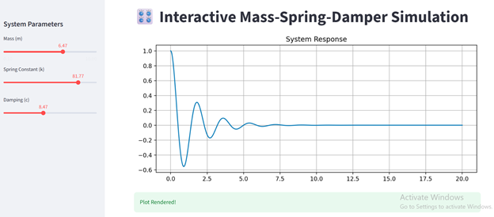

# 🌐 Interactive Vibration Lab (Streamlit)

This web application transforms the theoretical mass-spring-damper model into an interactive dashboard. It allows engineers and students to visualize mechanical vibrations in real-time without modifying Python code.

## 🚀 Web Interface Usage

The dashboard is designed for intuitive "what-if" analysis of mechanical systems.

### 1. Real-Time Parameter Tuning
Use the **Sidebar Sliders** to manipulate the physical properties of the system:
* **Mass ($m$):** Increasing mass increases inertia, leading to slower oscillations.
* **Spring Constant ($k$):** Increasing stiffness raises the natural frequency and increases the restoring force.
* **Damping ($c$):** Controls energy dissipation. Transition between a bouncy, **underdamped** state to a stable, **overdamped** response.

### 2. Live Physics Metrics
The app automatically calculates and displays key engineering values in the header:
* **Natural Frequency ($\omega_n$):** Calculated as $\sqrt{k/m}$.
* **Damping Ratio ($\zeta$):** Defines the system's behavior (Underdamped vs. Overdamped).
* **System State:** A dynamic label that tells you exactly how the system is behaving based on your inputs.


### 3. Interactive Visualization
As you adjust any slider, the physics engine (using `scipy.integrate`) re-solves the Ordinary Differential Equation (ODE) and updates the **Displacement vs. Time** plot instantly.



## 🛠️ Deployment Instructions

To launch the web interface locally:

1. **Install Streamlit:**

   ```bash
   pip install streamlit numpy scipy matplotlib
   ```


## About me

- Tran Quoc Thanh
- thanhtq2701@gmail.com
