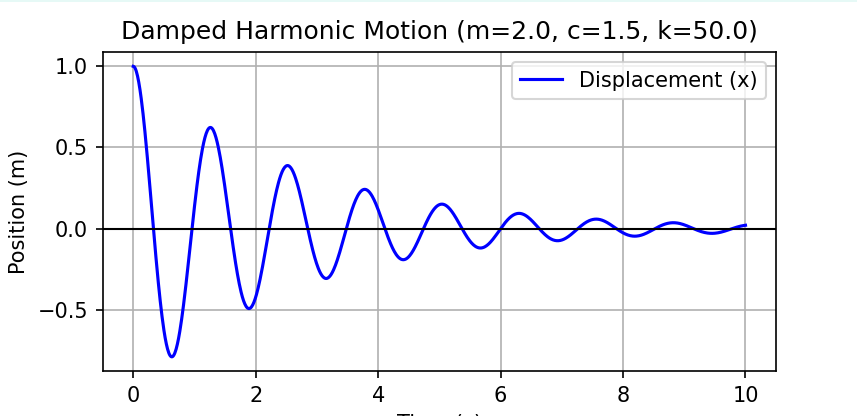

# Mass-Spring-Damper Vibration Solver

This Python project simulates the dynamics of a **Single Degree of Freedom (SDOF)** vibration system. It uses numerical integration to solve the differential equations governing motion in a mechanical system.

## 1. The Physics
The system is modeled after the standard linear second-order ODE:

$$m\ddot{x} + c\dot{x} + kx = 0$$

Where:
* **$m$**: Mass (Inertia)
* **$c$**: Damping coefficient (Energy dissipation)
* **$k$**: Spring constant (Restoring force)



[Image of a free body diagram for a mass spring damper system]


## 2. Features
* **Numerical Integration**: Uses `scipy.integrate.odeint` to solve the equations of motion.
* **Visualization**: Generates a time-domain plot of the mass displacement using `matplotlib`.
* **Configurable**: Easily adjust mass, stiffness, and damping to observe underdamped, overdamped, and critically damped behavior.

## 3. Installation
Ensure you have Python installed, then install the required dependencies:

```bash
pip install numpy scipy matplotlib
```

## 4. Usage
To run the simulation, execute the script from your terminal:

```bash
python vibration.py
```

## About me

- Tran Quoc Thanh
- thanhtq2701@gmail.com

